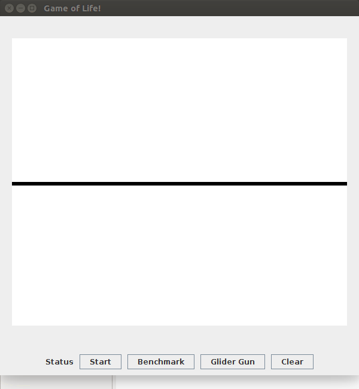

# game-of-life
This is a zero-player game which works on the four rules given by John Horton Conway.
[Wikipedia](https://en.wikipedia.org/wiki/Conway's_Game_of_Life)

# Demo

# Run it locally :blush:
:file_folder: Download the .zip [here](https://github.com/vshelke/game-of-life/archive/master.zip)
 
:mouse: Double click "Conway.jar"

Made with :yellow_heart: by [Vaibhav Shelke](https://github.com/vshelke).
